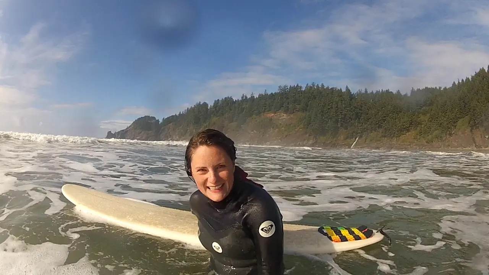

Since April/May of 2012 I started surfing. Being from the midwest this was never an option for me, but now after living in Washington for almost 5 years I figuered I should stop holding out for a trip to some place warm like Hawaii and just get in the water. This summer was filled with a lot of surf trips to Westport and the Olympic Peninsula. We also made it down to Oregon a couple times.

This past weekend we made it to the Oregon coast again. Here are the results of a blown out surf weekend:

`video: https://www.youtube.com/watch?v=hK1QvtYO-xU`

> Saturday's weather was a doozy. Rain, hail, sunshine. We had a long jumping contest. Our new stoke bro, Tony, won. The Pacific was kind and brought forth many shreddy rides. Sunday gave us glorious sunshine with a slight intermittent breeze. Choppy in the AM but we tamed those beasts. Later in the day the waves weren't shaping quite as nicely, making it hard to catch much of anything. On both days, the beach was littered with hikers and bikers. Hardly any surfers but a few were as dedicated as our troop. - Amanda

