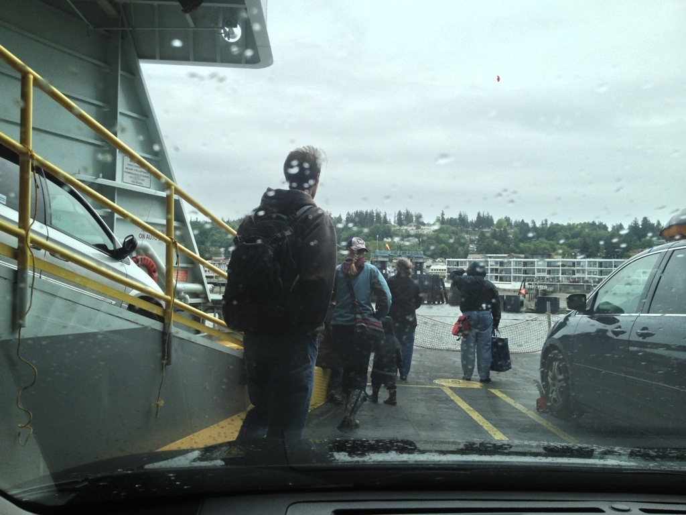

I went to Whidbey Island for the Memorial Day weekend. This was my first time on Whidbey and it was quite enjoyable, even with the rain.

The weekend started out right with an epic surf day at Westport. Rob and I enjoyed beers on the rocks after our morning session. I'm starting to feel a lot more comfortable on my board.

We departed on the Mukilteo ferry late Friday evening after surfing for the day at Westport. By doing so, we avoided the huge ferry lines. Shane's beard got some photo love with the beautiful horizon beyond.

The ferry ride is quite short. Arriving in Whidbey Island the surrounding terminal area seems much more chill than that of the San Juan island ferries. Whidbey doesn't seem to be as touristy as the San Juan's or even Bainbridge.

We spent the weekend at our friend's parents place. They recently purchased it and moved to Whidbey. The land had a horse farm among other small animals. We shot BB guns, went clamming, full dipped in the hot tub, drank many beers and cooked a lot of food.

We also spent some time checking out Fort Casey. This was a first for me, but as I'm told, many people who grew up in Seattle took several school trips there. There are stunning views of the Puget Sound from all over Fort Casey. While enjoying the views you can hear the children screaming from the halls of the dark, abandoned Fort.

Whidbey Island, thanks. It's been real.

