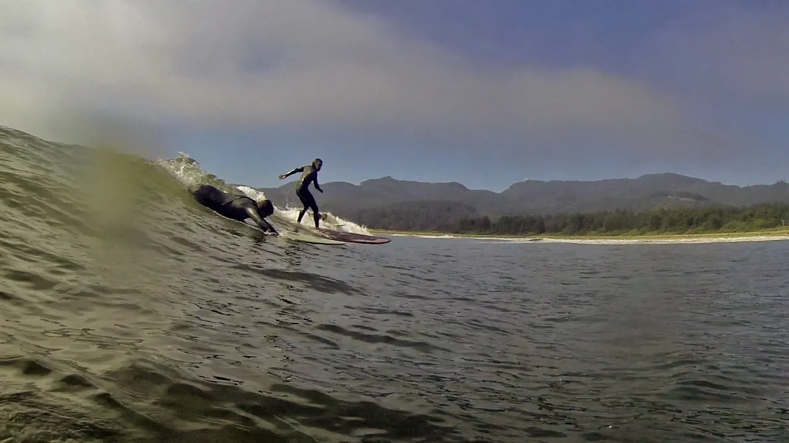
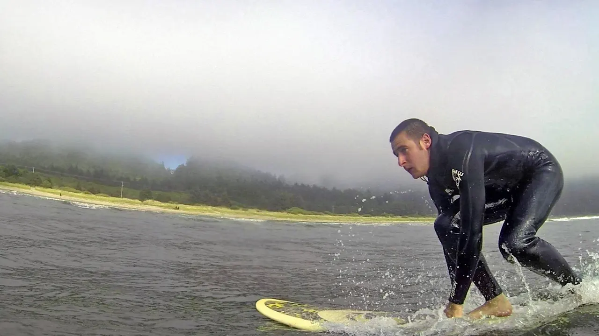
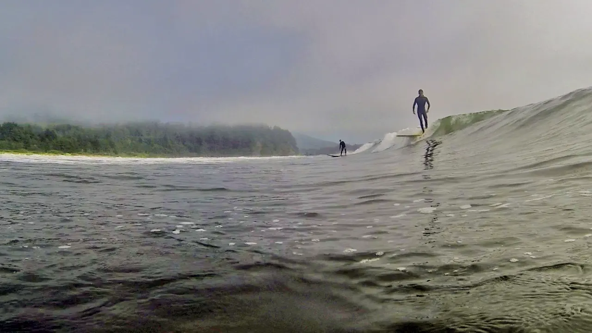
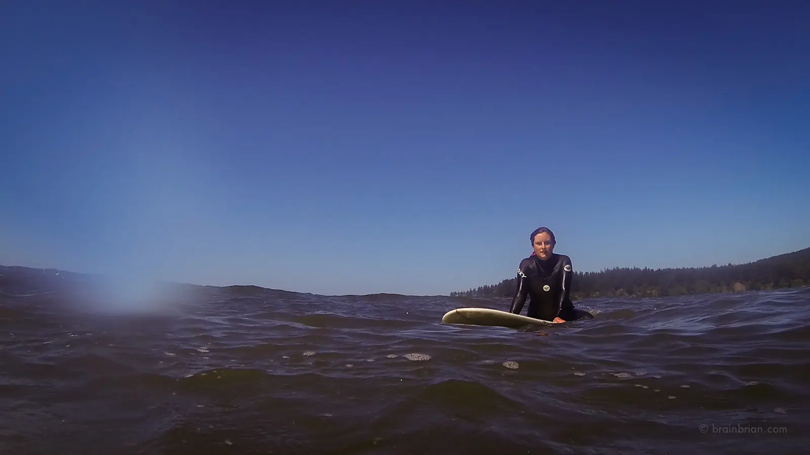
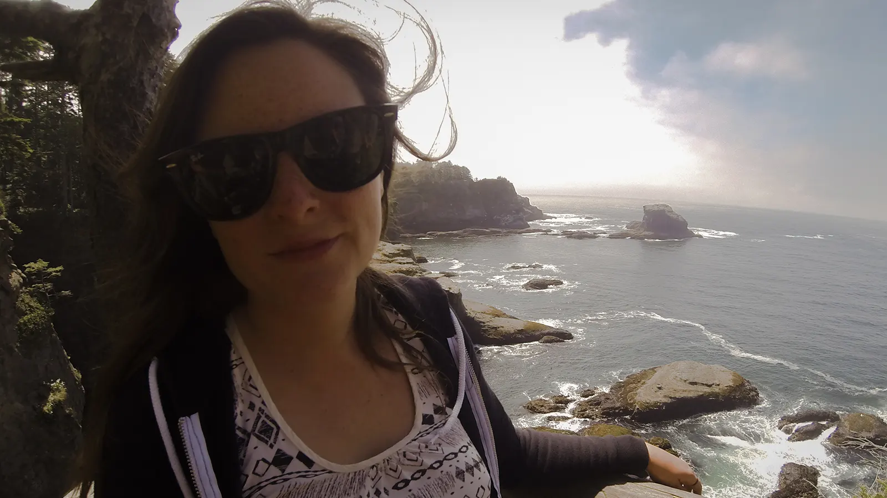
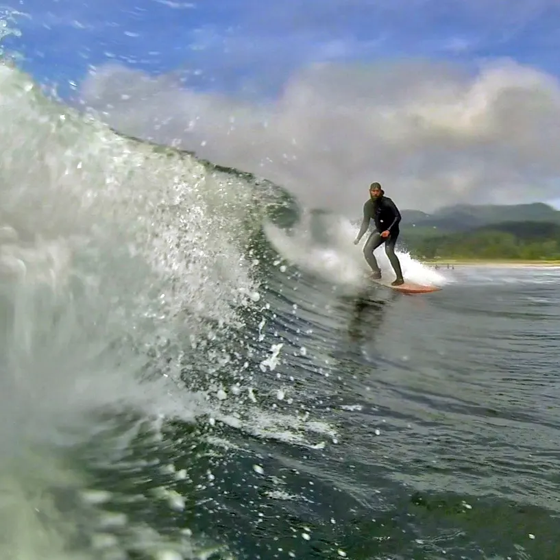

We decided to head out for a camp session on the Olympic Peninsula the weekend of July 26th, 2013. The waves were small and fun. They cleaned up great at specific times of the day. Sups, kayaks and surfboards were sporadic along the beach. Laughter could be heard from children playing, campfires crackling and waves crashing down. I love this place.

