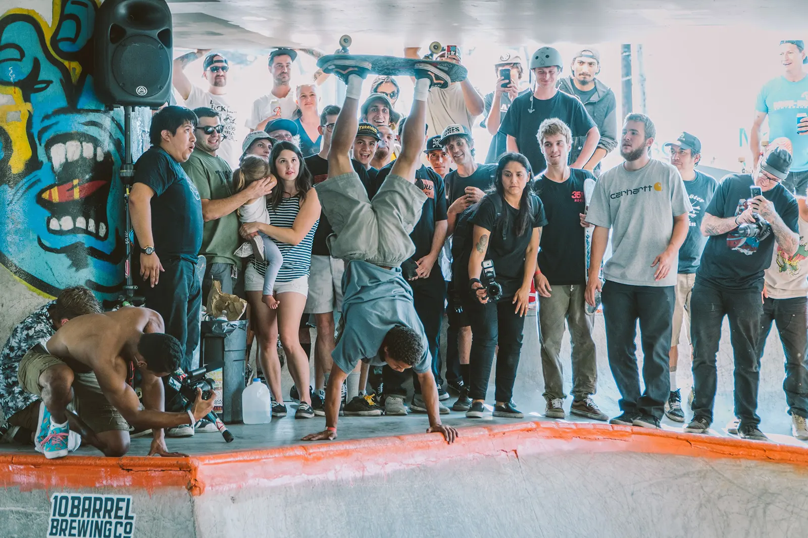

I was contacted by Thrasher earlier this year to use a photo of my of a [HoHo Plant](https://en.wikipedia.org/wiki/Freestyle_skateboarding_tricks#Street_Plant) at Marginal Way during the Lords of Seatown event. It appears in the [May 2020 issue](https://shop.thrashermagazine.com/magazines/back-issues/2020-back-issues/current-issue-thrasher-magazine-may-2020.html).

`video: https://www.youtube.com/watch?v=LWTpHWpx3uA`

This is the original photo published in the magazine.

Here's a video from the event via [Lib Tech](https://www.lib-tech.com/blog/2017/08/29/lords-seatown-2017/).
`video: https://vimeo.com/231479865`
