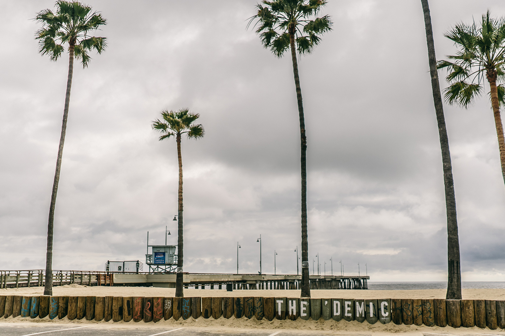
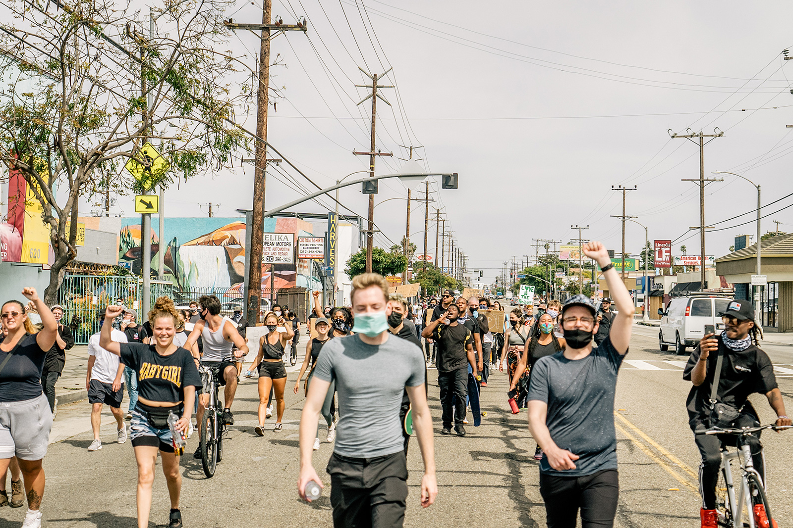
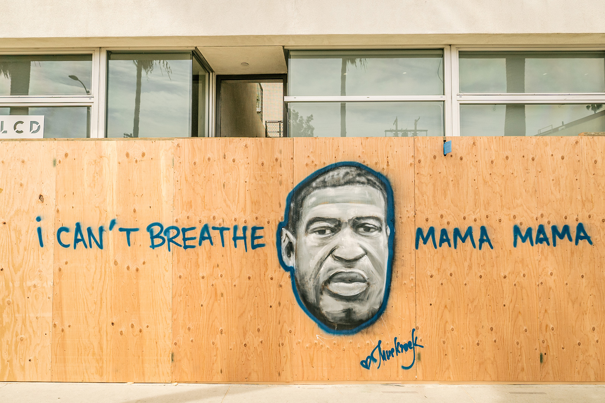
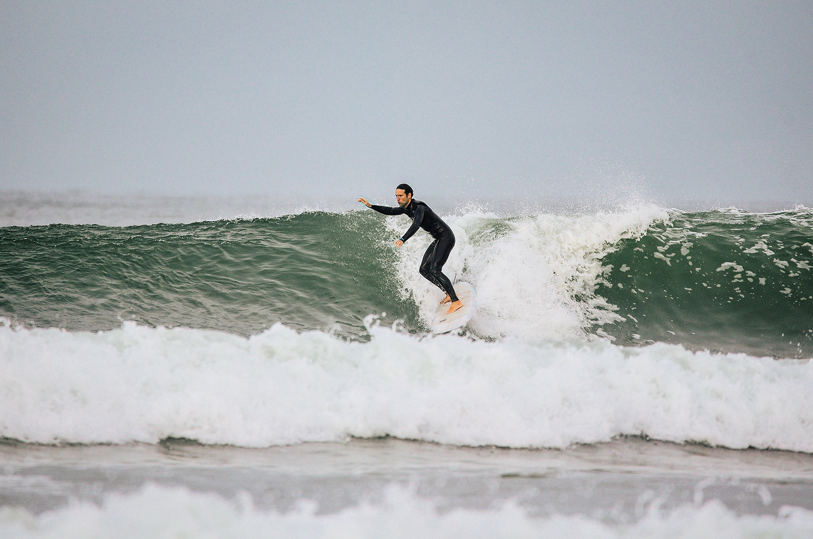
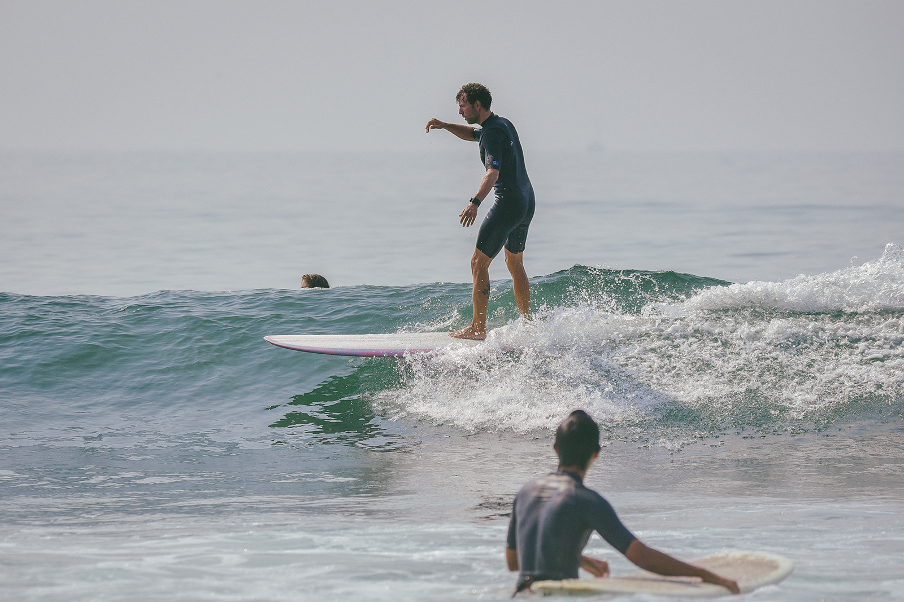

So much has happened in the past year. Going through a pandemic while living on the westside of LA has been a trip. The pandemic is littered with memories, unlike any others.

At the start of the Covid-19 pandemic I can remember biking to Venice Beach when the beaches were closed. It was an odd feeling worrying about an officer seeing me biking to the beach with my board in tow. I remember one-morning biking so fast because I had seen a cop. We would surf until about 8 am until the lifeguards would show up and kick us out, blasting their megaphones and sirens.

It was also wild living on the westside of LA during the George Floyd protests. The day of the looting in Santa Monica was a little scary around the Westside but we remained safe, but a little shaken. It was good to see the community come out to march against these injustices.

The pandemic has also brought about a lot of changes in the workplace. Most of us have been working from home for the past year. My wife and I were in a 2 bedroom apartment in Venice and my office was our kitchen for at least 8 months before were fortunate enough to find a new home in LA. Our new home has been great both for us and our dachshunds. We even added a new member to the family, meet Tilly.

With all the changes to companies now supporting remote working situations, I applied to a dream job of mine headquartered in Huntington Beach. I had not previously applied because I did not want to deal with commuting. In April I started my new role as a Staff Software Engineer at [Surfline](https://www.surfline.com). Surfline now supports a "work from anywhere" policy. I still am excited to get into our office from time to time (when it opens), but am very happy to find a place that will allow me the freedom to work in a way that best suits my lifestyle. I am starting a Web Platform squad at Surfline focused on our design system, architecture, shared packages, shared services, developer experience/tools and more.

With all the ups and downs of Covid, I'm very grateful to be where I am today.

Thank you [Shacked Mag](http://www.shackedmag.com) for the last two photos of me surfing.
