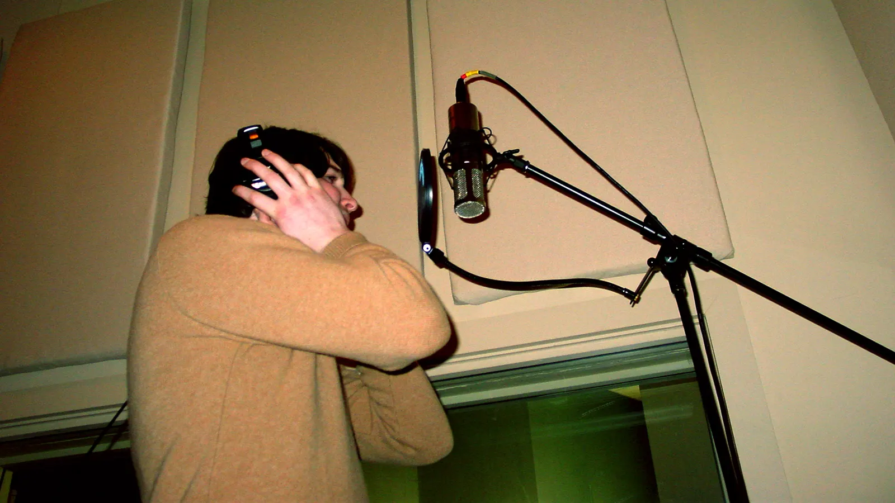
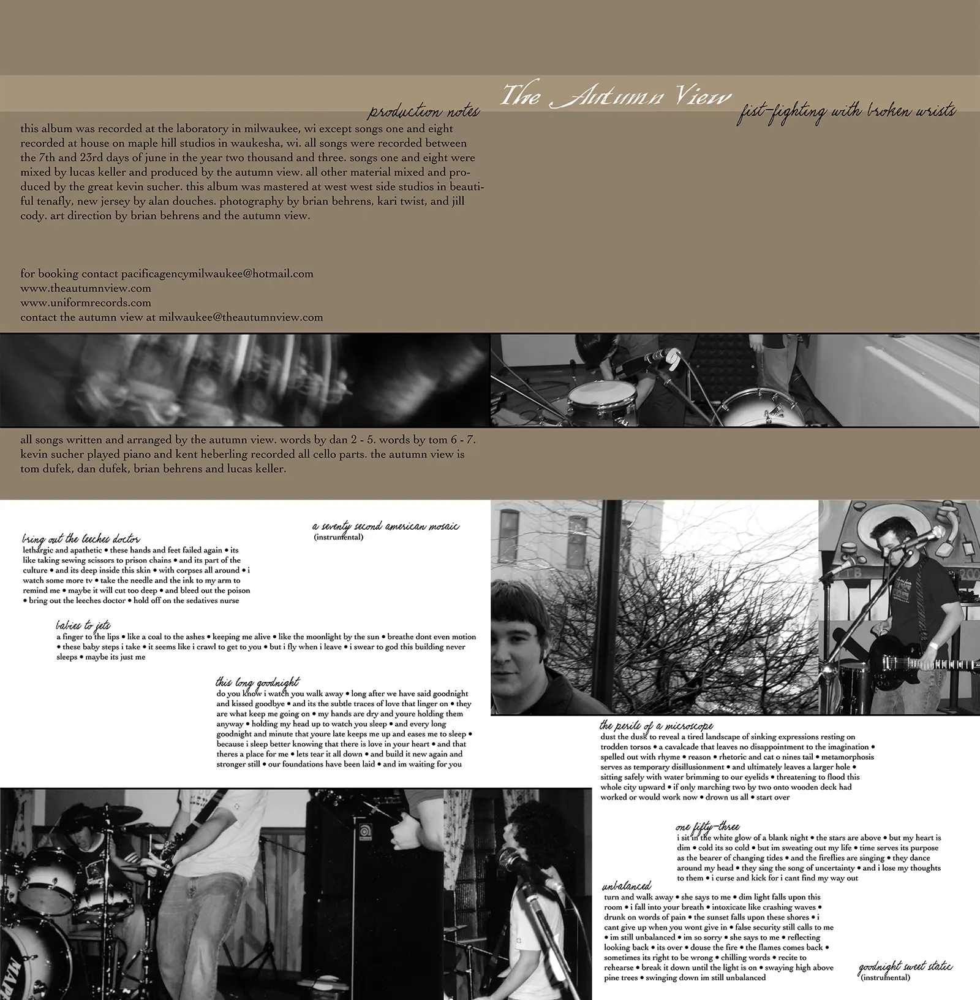
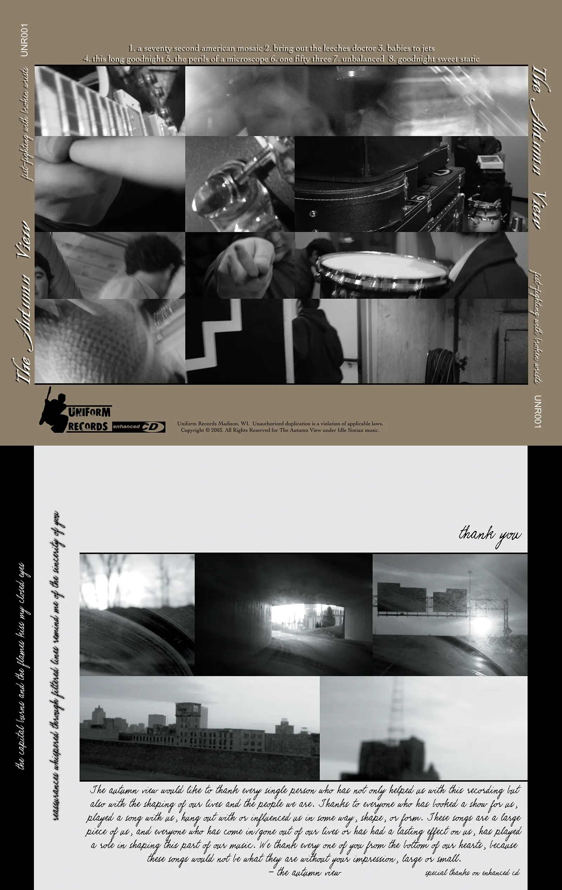
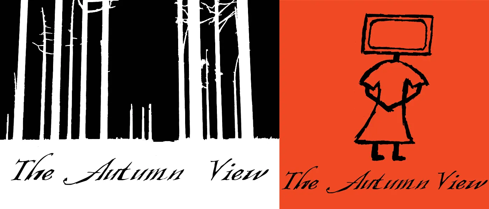
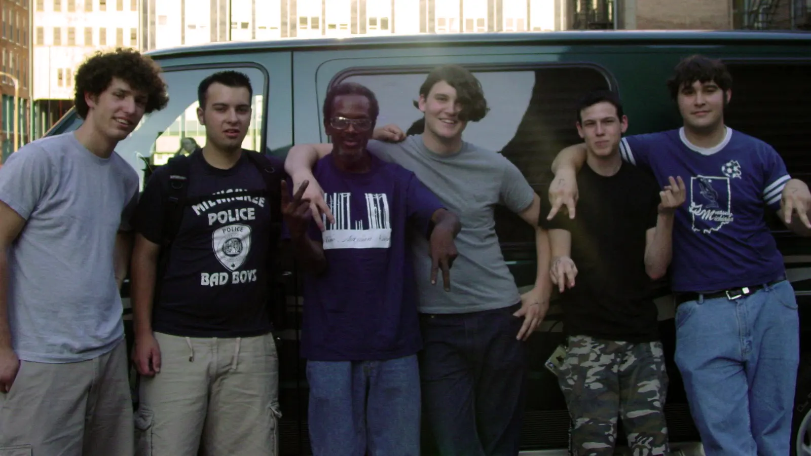

Throughout high school and college I played in a couple of bands. One of the bands was called (for the majority of the time) "The Autumn View". I started out playing guitar in the band in middle school when we were called "Westbound". We evolved over the years, as many adolescents do.

## "This Room Could Swallow Me" by The Autumn View

`video: https://www.youtube.com/watch?v=8Cf3RWETlFM`

This video is a collection of footage from our recording session in Chicago of our 2 song EP with [Matt Allison](<https://en.wikipedia.org/wiki/Matt_Allison_(record_producer)>) at [Atlas Studios](https://www.facebook.com/atlaschicago/).

In 2003 we released our first full-length record on our friend's label, Uniform Records. This release is titled "Fist-Fighting with Broken Wrists". Below is the album artwork for the CDs that went into production. I did the graphic design on the album.

Below is footage from our CD Release show for the above album. This was the start of a tour we took to California and back.

`video: https://www.youtube.com/watch?v=I64-BUpv-cM`

These are 2 of many t-shirt designs we came up with over the years. The one on the left was, I believe, the most popular design. The "TV Girl" on the right was one of my favorites.

## Collection of Albums

Here is a collection of music we released as "The Autumn View" for your listening pleasure.

### [The Autumn View - 2 Song Demo (2003)](https://soundcloud.com/brainbrian/sets/the-autumn-view-2-song-demo-2003)

Recorded in Chicago with [Matt Allison](<https://en.wikipedia.org/wiki/Matt_Allison_(record_producer)>) at [Atlas Studios](https://www.facebook.com/atlaschicago/)

<iframe width="100%" height="560" scrolling="no" frameborder="no" allow="autoplay" src="https://w.soundcloud.com/player/?url=https%3A//api.soundcloud.com/playlists/449394&color=%23ff5500&auto_play=false&hide_related=false&show_comments=true&show_user=true&show_reposts=false&show_teaser=true&visual=true" style="max-width: 640px;"></iframe>

### [The Autumn View - Fist-Fighting With Broken Wrists (2003)](https://soundcloud.com/brainbrian/sets/fist-fighting-with-broken-wrists)

First and only full-length

<iframe width="100%" height="700" scrolling="no" frameborder="no" allow="autoplay" src="https://w.soundcloud.com/player/?url=https%3A//api.soundcloud.com/playlists/409954&color=%23ff5500&auto_play=false&hide_related=false&show_comments=true&show_user=true&show_reposts=false&show_teaser=true&visual=true" style="max-width: 640px;"></iframe>

### [The Autumn View - For All The Wrong Reasons... (1999)](https://soundcloud.com/brainbrian/sets/for-all-the-wrong-reasons)

Split EP with 52 Pick-Up

<iframe width="100%" height="700" scrolling="no" frameborder="no" allow="autoplay" src="https://w.soundcloud.com/player/?url=https%3A//api.soundcloud.com/playlists/410366&color=%23ff5500&auto_play=false&hide_related=false&show_comments=true&show_user=true&show_reposts=false&show_teaser=true&visual=true" style="max-width: 640px; margin-bottom: 2rem; display: block;"></iframe>

