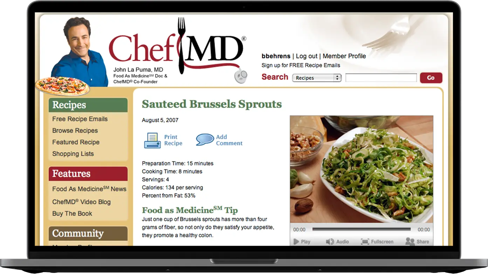

ChefMD.com is an online site supporting the ChefMD television segment appearing on Health Corner airing on Lifetime. I brainstormed, planned, and lead development on the site. We built a custom CMS with PHP and MySQL to support recipes, shopping lists, videos, member registration, news, and email lists. The site also includes helpful tools like health calculators and searching for recipes by health conditions.

