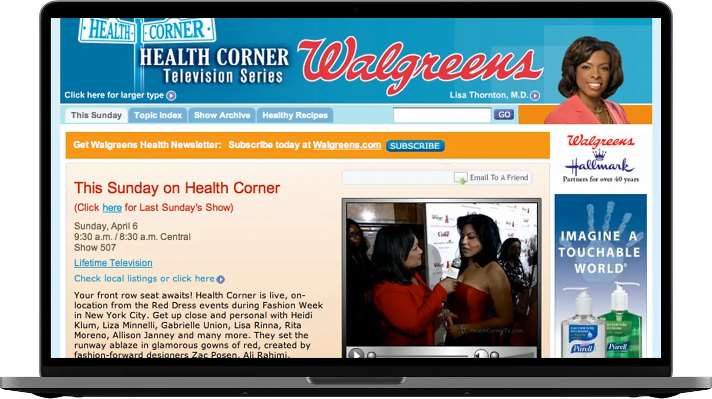
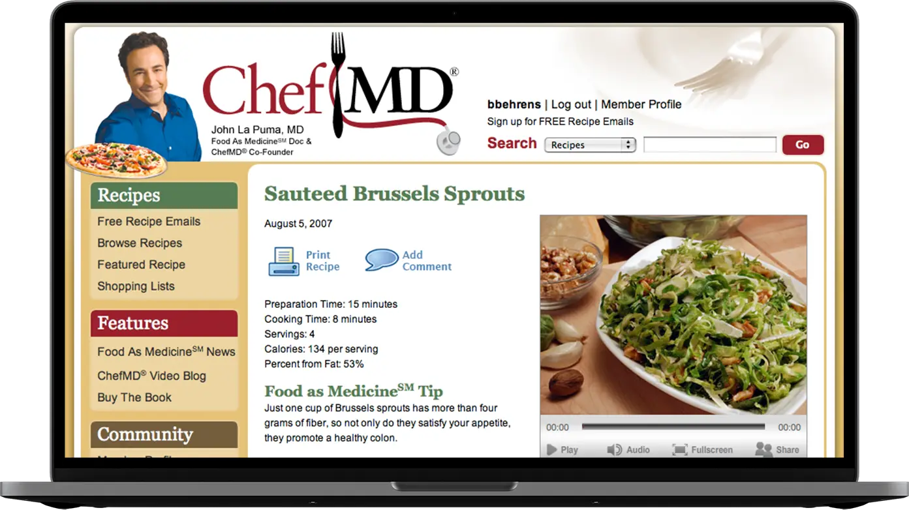

## Health Corner

#### December 15th, 2006

While at [Marx Creative](https://www.linkedin.com/company/marx-creative/about/) I worked on the publishing and distribution of the [Health Corner TV Series](https://www.imdb.com/title/tt1243727/), independently produced for [Walgreens](https://www.walgreens.com), airing on [Lifetime](https://www.mylifetime.com). I helped distribute video both online and through the production of DVDs. I assisted developing an in-store video network initiative between Marx Creative and Walgreens.

## ChefMD Online

#### October 1st, 2007

[ChefMD.com](https://www.drjohnlapuma.com/chefmd/) is an online site supporting the ChefMD television segment which appeared on the Health Corner TV Series. I brainstormed, planned, and lead development on the website.

We built a custom CMS with PHP and MySQL to support recipes, shopping lists, videos, member registration, news, and email lists. The site also includes helpful tools like health calculators and searching for recipes by health conditions.

