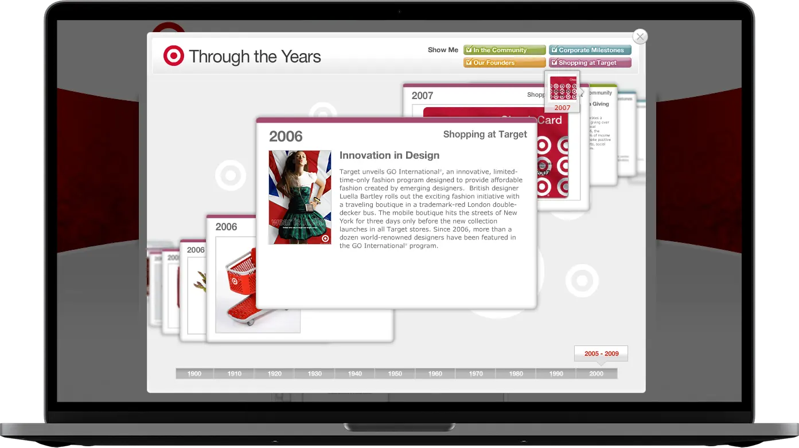
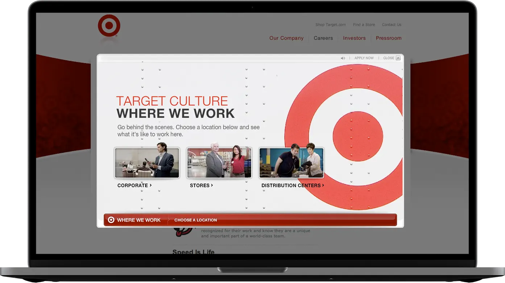
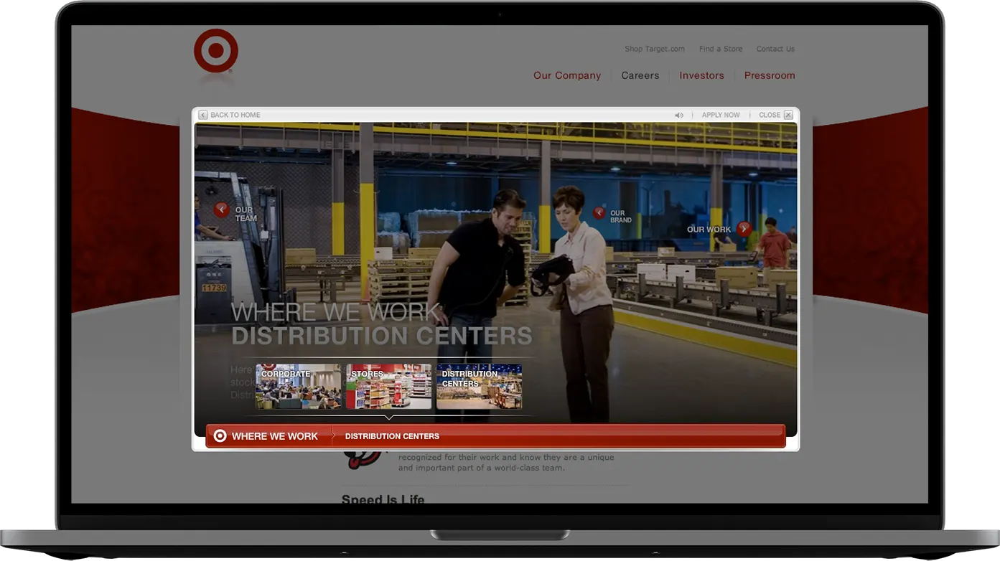
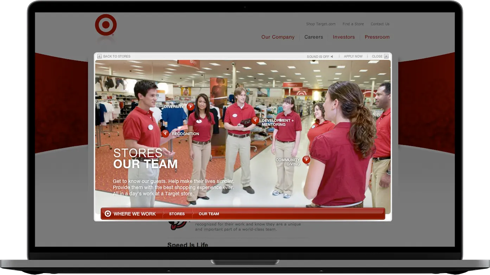

## Through The Years (Timeline)

#### August 1st, 2010

Target came to POP with an ask to turn their [history page](https://www.target.com/history) into a more interactive and engaging online experience. The history page used to be one long scrolling page of information.

Target was very happy with outcome of the new interactive version where users can interact with individual points in Target's history and filter by different categories. I was the Flash developer and animator on this project. I also played an active roll in brainstorming and planning the experience.

## Where We Work

#### February 1st, 2008

The first project I worked on while at POP was [Where We Work](https://www.target.com/wherewework). It was my first project at POP and it was quite successful.

The interactive tour of Target's different workplaces is filled with rich photos, text and video. I was the lead developer and animator on the project.

