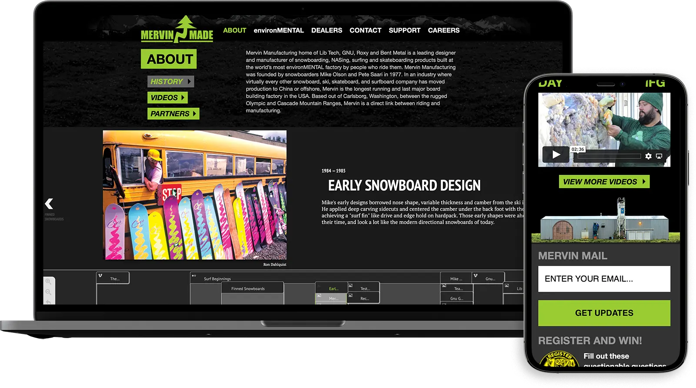
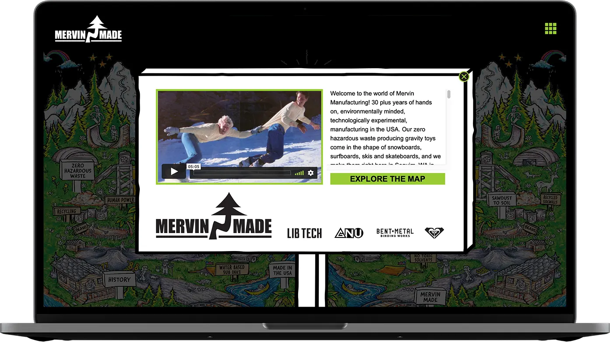

## Responsive Website Rebuild

The [Mervin Manufacturing website](https://www.mervin.com) was a much-needed rebuild. I built the new WordPress template with the assistance of a designer at Mervin. All of the development was completed by myself.

This is the first responsive site I have built for any of the Mervin brands. It's simple and easy to use. We will be adding more features as time goes on.

(Another day at the office)

I also assited the current developer, previously the junior developer I hired on, in building out the [Mervin Made website](https://www.mervinmade.com) while on contract. Here, users could explore the Mervin Made website and learn more about Mervin Manufacturing.

Enjoy this video with a bit of history about Mervin, Mike and Pete.

`video: https://vimeo.com/236668189`

I sure do miss my Mervin Family!

I will forever miss that office in the Fremont neighborhood of Seattle, Washington.

`video: https://www.youtube.com/watch?v=ZQWqYlQI-PA`
