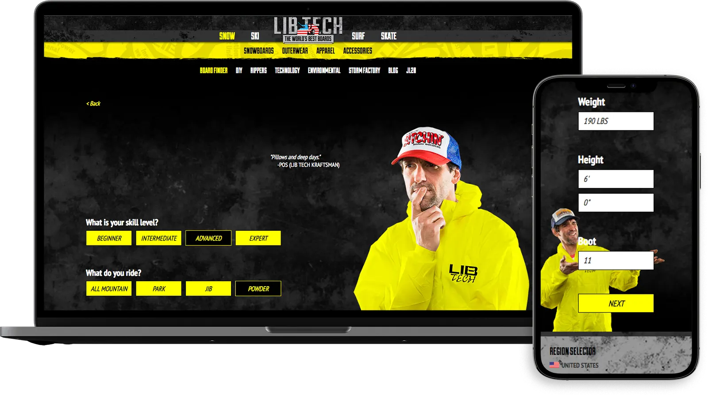
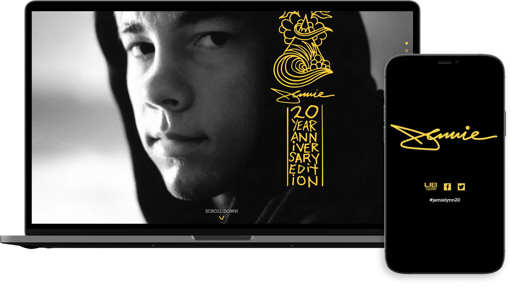
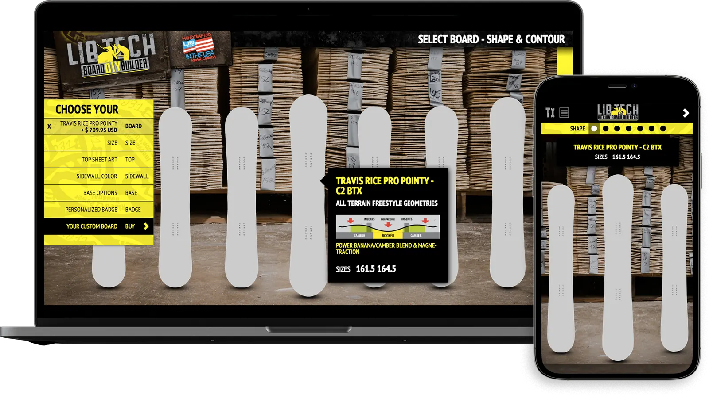
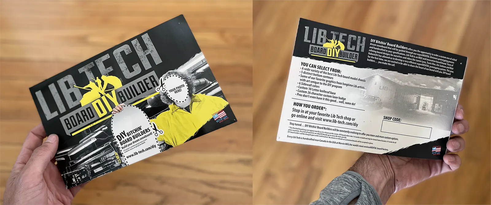
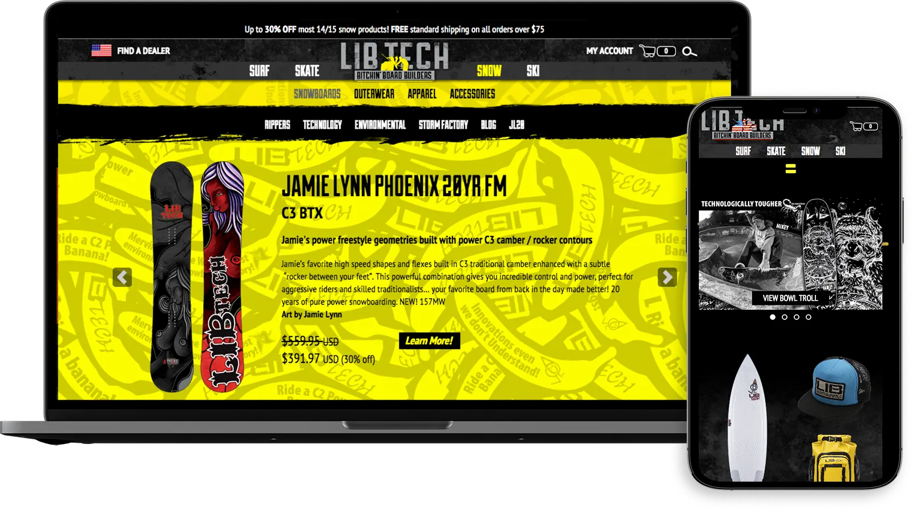
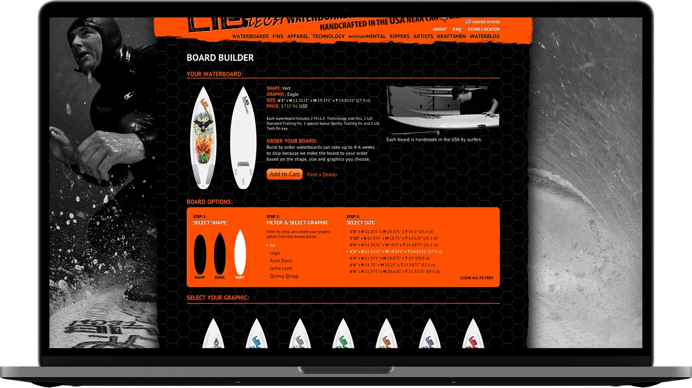

## Snowboard Finder

#### December 1st, 2015

While at [Mervin Mfg.](https://www.mervin.com) we were tasked with building a [web application](https://www.lib-tech.com/snowboarding/snowboard-finder/) that would take in user data and suggest snowboards based on their body types and skill. Custom fields were added to track specific board ratings based on terrain and skill level. I built this application with AngularJS and custom JSON output through WordPress page templates.

## Jamie Lynn 20 Year Anniversary

#### November, 2014

The 2014/2015 winter season was the 20 year anniversary celebration of professional snowboarder Jamie Lynn’s pro line with Lib Technologies. In honor of his 20 years of pro-models with Lib Tech we planned a marketing campaign around his career history and products.

`video: https://vimeo.com/112238604`

We built a [responsive, scrolling website](https://www.lib-tech.com/snowboarding/jamie-lynn-20-year-anniversary/) to showcase photos, products, notable quotes from industry pros and a featured 20 year video. The website uses complex scrolling techniques to preset a pleasing, focused look into Jamie’s career with Lib Technologies.

## DIY Snowboard Builder

#### October 1st, 2013

During the 2013-2014 snowboard season the Mervin Mfg. web team was tasked with building an online, [do-it-yourself snowboard builder](https://www.lib-tech.com/diy).

We are fortunate at Lib Tech to build our snowboards in the USA at our own factory in Sequim, WA. This allows us to do experimental programs like the diy builder and scale them based on their success.

Designed by David Kiker

The web application utilizes responsive web-design and Shopatron’s Add-To-Cart API to allow users to design and order their own custom one-of-a-kind snowboard delivered right to their doorstep from any device. Users can build their own snowboard while heading up a lift for some pow turns!

<iframe width="320" height="530" src="https://www.instagram.com/p/jjxe9KuzaL/embed/" frameborder="0" style="margin: 0 auto; display: block;"></iframe>

## Responsive E-commerce Website

#### 2012-12-01

The Lib Tech [brand and e-commerce website](https://www.lib-tech.com) is an ever-evolving project I have lead development on since 2012. Over that time we’ve reworked the entire shopping experience to use [Shopatron’s latest JavaScript APIs](/documents/shopatron-mervin-manufacturing-case-study.pdf) and have one experience, both brand and e-commerce within the same website. We’ve rolled out responsive templates, product finding and building applications, micro-site marketing experiences, as well as focusing on SEO and browser compatibility. I planned and built our build system using Grunt.js, SASS and our own JavaScript design patterns.

[Shopatron Case Study with Mervin Manufacturing](/documents/shopatron-mervin-manufacturing-case-study.pdf)

## Surfboard Launch Website

#### October 1st, 2012

This was the first project I took on at Mervin Manufacturing. Per Pete and Mike's request, they wanted users to be able to purchase one of three shapes online and be able to decide on a vol ume and graphic combination. This was one page of a much larger WordPress site. The site explained a lot about the completely new surf construction introduced to the industry. This site evolved in the coming months and years and was merged into the main Lib Technologies website.

