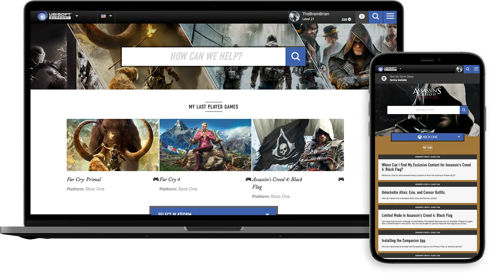

Ubisoft came to POP for a overhaul on their [customer support website](https://support.ubi.com). This project was a little different than normal. I lead the development team at [POP](https://www.wearepop.com) in a co-development of the site with Ubisoft’s backend team.

We provided static site template files with static JSON endpoints that Ubisoft then integrated into their support backend system. This was a great partnership between POP and Ubisoft, and the result is one fantastic, responsive customer support website.

