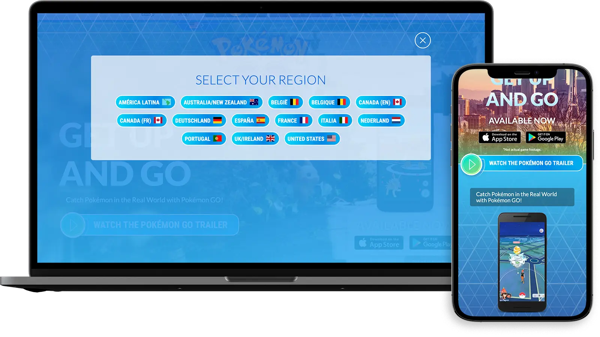
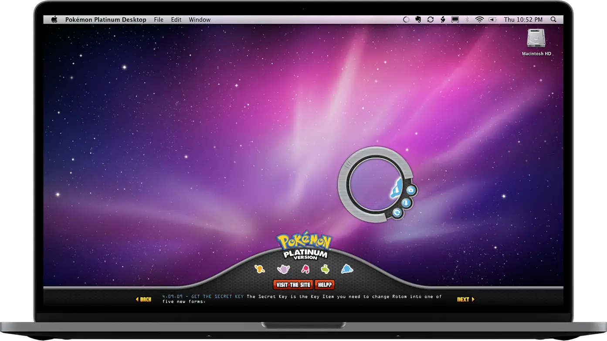

## Pokémon Go Website

### 2016-06-06

https://www.pokemongo.com/en-us/

...

## Pokémon Platinum: Rotom Viewer Desktop Application

### 2009-10-01

Pokémon tasked POP with creating a fun gift for Pokémon fans to unlock when they purchased a game and found the code inside the packaging. Fans could then go to [pokemonplatinum.com/#/rotom/](https://www.pokemonplatinum.com/#/rotom/) with their code and download the Adobe AIR Desktop application linked to above. I was the lead developer on the project.

