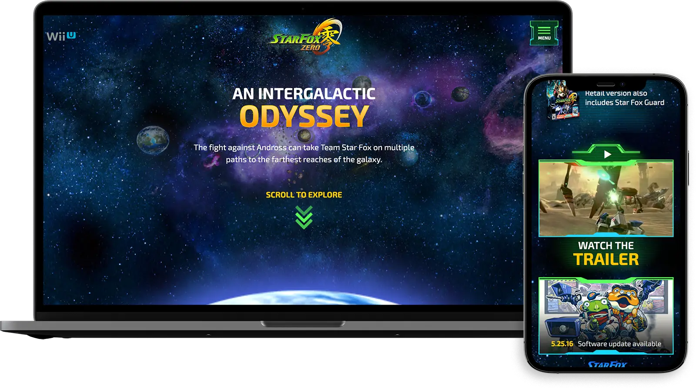

Nintendo did a reboot of Star Fox for the Wii U. With the Star Fox Zero website we tried to convey the feel of Star Fox world online. Bringing in rich character art and dynamic animations we brought this reboot to life. Dynamic galaxy animations behind the menu overlay using HTML5 canvas, complex scrolling animations within the Lylat System and in depth character and vehicle interactions all bring this site to life. I was the lead interactive developer on this project at [POP](https://www.wearepop.com/).

