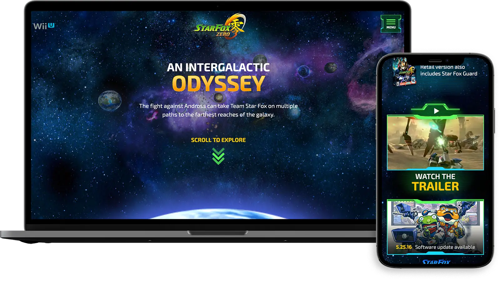
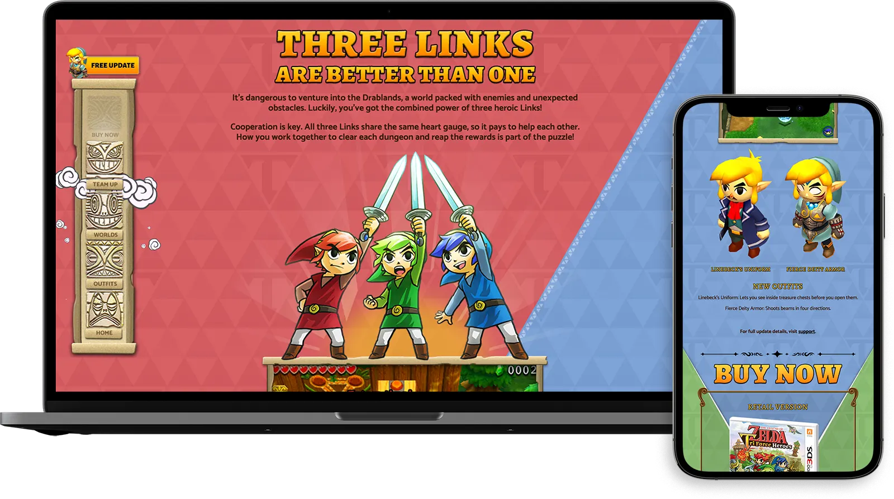
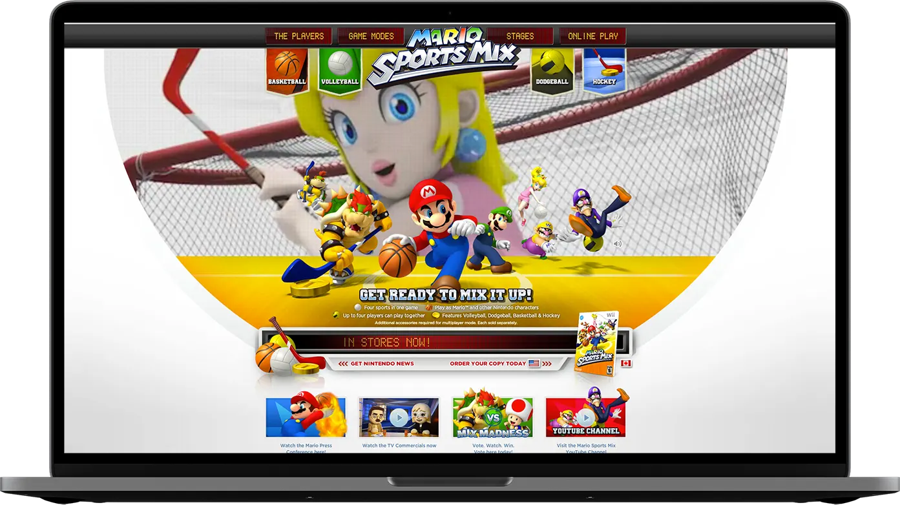
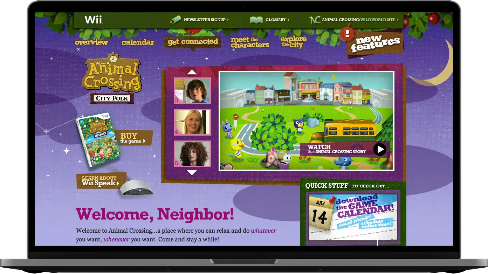

## Star Fox Zero

#### April 21st, 2016

Nintendo did a reboot of Star Fox for the Wii U. With the [Star Fox Zero](https://starfoxzero.nintendo.com) website we tried to convey the feel of Star Fox world online. Bringing in rich character art and dynamic animations we brought this reboot to life. Dynamic galaxy animations behind the menu overlay using HTML5 canvas, complex scrolling animations within the Lylat System and in depth character and vehicle interactions all bring this site to life. I was the lead interactive developer on this project at [POP](https://www.wearepop.com/).

## The Legend of Zelda: Tri Force Heroes

#### October 22nd, 2015

We created the [Tri Force Heroes](https://zelda.com/tri-force-heroes/) website to promote the game for the Nintendo 3DS. It has a unique multiplayer component we tried to bring to life throughout with scrolling-triggered (waypoints) animations throughout site. The user is taken through page content by scrolling vertically or interacting with the totem navigation when on desktop. The site comes to life with interactive animations all done with CSS and JavaScript. I relied heavily on the [Greensock GSAP](https://greensock.com) for scripting the animations. I was the lead interactive developer on this project at [POP](https://www.wearepop.com). We used Grunt as our front-end static build system along with SCSS and CommonJS modules.

## Mario Sports Mix

#### November 25th, 2010

While at POP, I was the lead interactive developer on the [Mario Sports Mix site](https://mariosportsmix.nintendo.com). The site promoted the upcoming game for the Nintendo Wii. We used 3D animation and a lot of motion to bring the site to life.

## Animal Crossing: City Folk

#### November 16th, 2008

I've assisted in many Nintendo projects while working at POP, but [Animal Crossing: City Folk](https://www.animal-crossing.com) for the Wii was the first project I played a lead roll in. I developed the Flash components, captured, and processed a large portion of the gameplay content.

