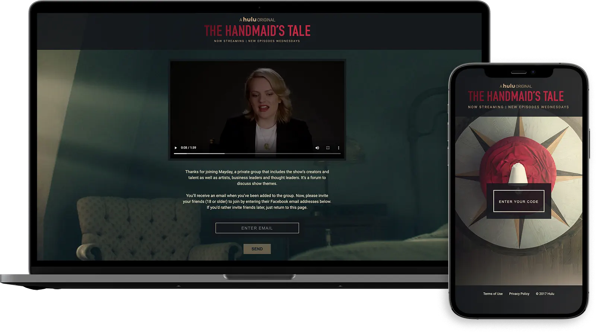
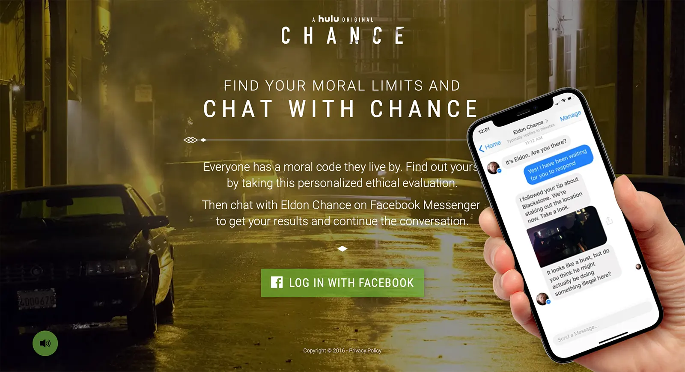

## Join Maidez - The Handmaid's Tale

Hulu's [The Handmaid's Tale](https://www.hulu.com/the-handmaids-tale) is now airing. I built a single page application on AWS using Lambda, S3, NodeJS, Webpack, React, Redux and Babel to support their social campaign. This application takes in a users code, grants them access to a secret group and allows them to invite up to 5 friends.

## Chance Chatbot

While at [POP](https://www.wearepop.com) we worked on a Facebook chat bot for Hulu's orginal show [Chance](https://www.hulu.com/series/chance-e9b6cb5f-44f0-4c41-9dbc-4247fec9f3e9). I partnered with a coworker on the engineering. We used an AWS serverless cloud based architecture with Lamdas written with Node.js. We did natural language processing with [wit.ai](https://wit.ai).

I also worked on the [Find Your Limits](http://findyourlimits.com) site where users would originally complete a series of questions and register for the chat bot. The site would take in basic information about them and blend it with information from the show to test their moral limits.

In the press:

-   [decider.com](https://decider.com/2016/10/28/hulu-chance-chat-module/)
-   [campaignlive.com](https://www.campaignlive.com/article/hulu-launches-chatbot-new-chance/1413800)
