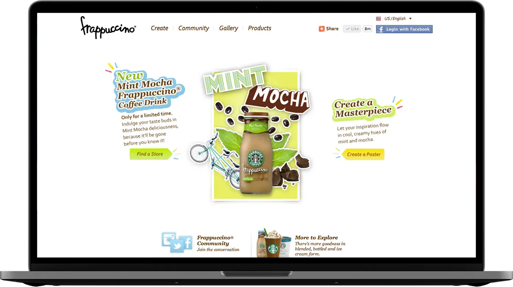

## Outlook Add-in

### 2017-06-09

https://www.starbucks.com/promo/starbucks-for-outlook

The Starbucks Outlook Add-In for Microsoft Outlook is an application that allows users to send Starbucks Gift Cards through their email with ease. I led JavaScript development on this project. We revamped an existing AngularJS code base, updated features and provide support.

## Frappuccino Brand Website

### 2011-11-01

https://www.frappuccino.com

I helped concept, plan and build all things digital surrounding the Frappuccino brand in 2011. On frappuccino.com users could build drinks and an accompanying poster to promote their drink. They were then entered into a contest and awarded prizes for the most liked drink. I also worked on various paid media campaigns and the mobile website. I'm currently working on the 2012 version of the Frappuccino digital brand.

## Pumpkin Spice Latte Facebook Campaign

### 2011-09-01

https://www.mashable.com/2011/08/18/starbucks-pumpkin-spice-latte-facebook/

The Starbucks team at Blast Radius was tasked with creating a campaign to reward a city with the most excitement around the fall launch of pumpkin spice latte. I was a lead in the conception and development of the Facebook application that allowed users to get PSL a week early in their city. The city earning the most points would win. Facebook users were given various tasks to complete in order to receive points.

