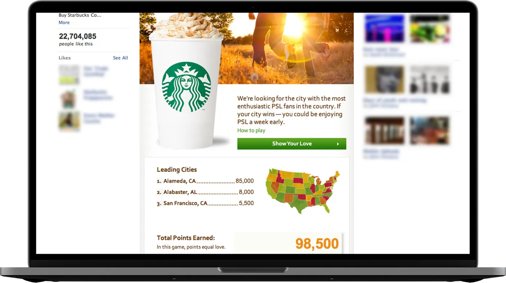

Over the years working at both [POP](https://www.wearepop.com) and [Blast Radius](https://www.linkedin.com/company/blast-radius/) I often found myself working on projects with Starbucks as a client. We delivered on anything from simple digital banners to complex applications.

## Outlook Add-in

#### July, 2017

The [Starbucks Outlook Add-In](https://www.onmsft.com/news/microsoft-releases-starbucks-outlook-add-5-egift-card-sharing-via-outlook) for Microsoft Outlook was an application that allowed users to send Starbucks Gift Cards through their Outlook email with ease. Users right within Outlook could select from a collection of branded eGift Cards that could be sent securly over email.

Users could decide on a dollar amount to send to any email by attaching the eGift to any outgoing email message. eGifts were then securly attached to the outgoing email for redemption from the reciever.

I led JavaScript development on this project. We revamped an existing [AngularJS](https://angularjs.org) and [Ionic framework](https://ionicframework.com/docs) code base, updated features and provide support. Users could also suggest a Starbucks to meet at via a store locator built into the Outlook add-in.

<video autoplay loop muted playsinline width="100%">
  <source src="/videos/starbucks-outlook-addin.mp4" type="video/mp4">
</video>

Video from [Starbucks Facebook](https://www.facebook.com/outlook/videos/1078301122256530/)

## Frappuccino Brand Website

#### November, 2011

I helped concept, plan and build all things digital surrounding the [Frappuccino](https://www.frappuccino.com) brand in 2011.

On frappuccino.com users could build drinks and an accompanying poster to promote their drink.

They were then entered into a contest and awarded prizes for the most liked drink. I also worked on various paid media campaigns and the mobile website.

I'm currently working on the 2012 version of the Frappuccino digital brand.

## Pumpkin Spice Latte Facebook Campaign

#### September, 2011

The Starbucks team at Blast Radius was tasked with [creating a campaign](https://www.mashable.com/2011/08/18/starbucks-pumpkin-spice-latte-facebook/) to reward a city with the most excitement around the fall launch of pumpkin spice latte.

I was a lead in the conception and development of the Facebook application that allowed users to get PSL a week early in their city.

The city earning the most points would win. Facebook users were given various tasks to complete in order to receive points.

