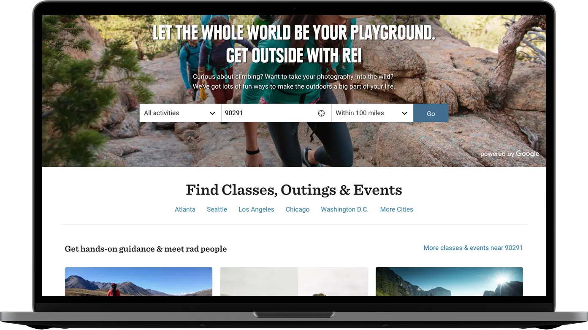
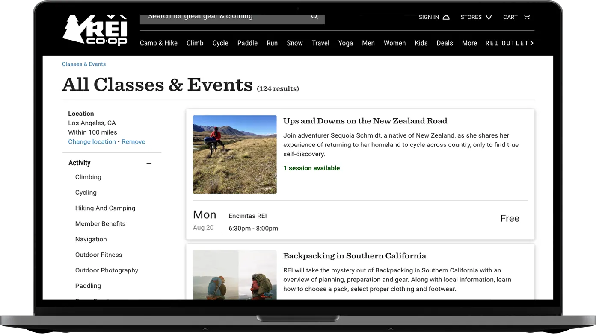
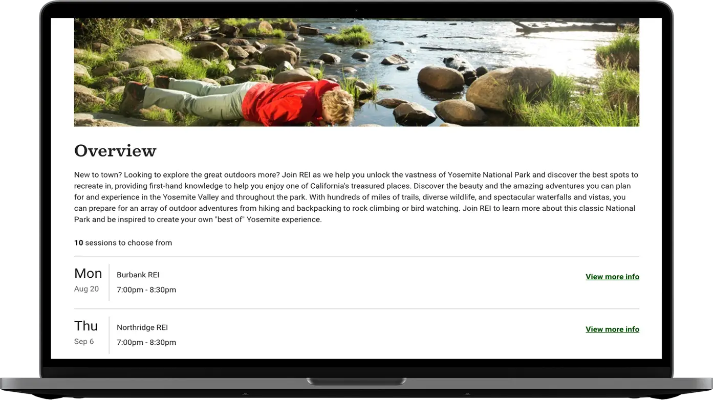

At [REI](https://www.rei.com) I supported the [Classes &amp; Events](https://www.rei.com/events) and [Adventures](https://www.rei.com/adventures) team. I led frontend software engineer for the team. We supported both applications. We were a team of engineers, a project manager, SDET and a product manager.

Our front-end engineers would come together as a guild to address issues across the organization. As a software engineer, we often had to manage remote developers. We worked in Agile methodology to deliver on product features.

We used a continuous integrated environment with Docker, Java, Jenkins and more. I was responsible for upgrading to ES6 linting standards with [Vue.js](https://vuejs.org). We delivered pages and components that could be used throughout the REI website. Dependency management on the frontend is done via our private NPM repository.

