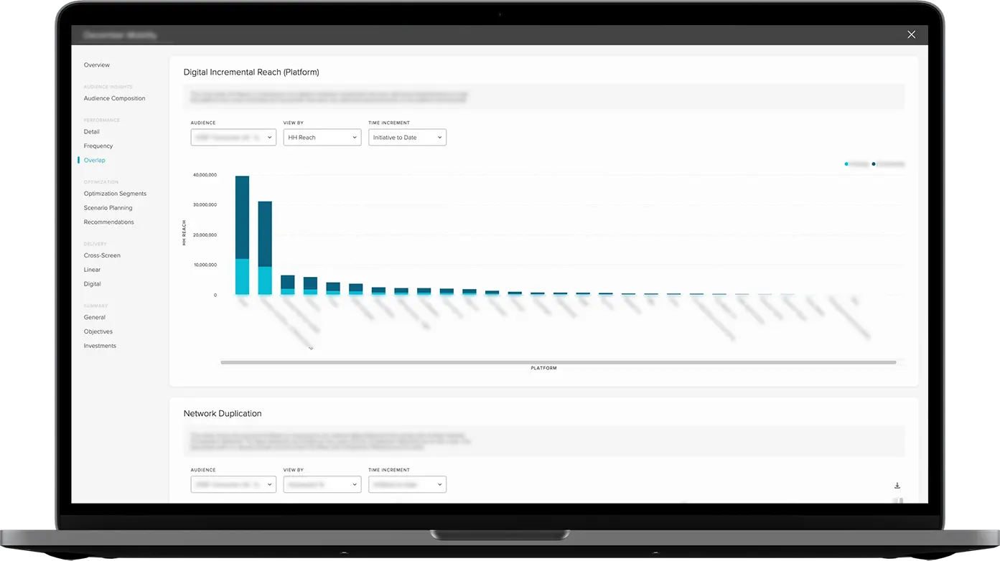

I started my VideoAmp journey in October of 2018. We moved to Los Angeles for my wife's job. I was originally working for REI when we moved, but quickly looked for a job on the Westside as isolation was taking its toll on me.

The [VideoAmp Platform](https://videoamp.com/platform/) enables advertisers to optimize all of their linear television, OTT and digital advertisments to business outcomes. It allows our users to measure their ad's performance against useful sets of metrics.

I was hired on to the Design Ops team where we developed our [PreAmp Design System](https://preamp.design), developed shared tools and helped deliver on feature development. I now work primarily on our Measurement application allowing our users to monitor past and active investment initiatives.

<video autoplay loop muted playsinline width="100%">
  <source src="https://videoamp.com/wp-content/uploads/2020/05/engineering-clip.mp4" type="video/mp4">
</video>

Video from [VideoAmp.com](https://videoamp.com)
